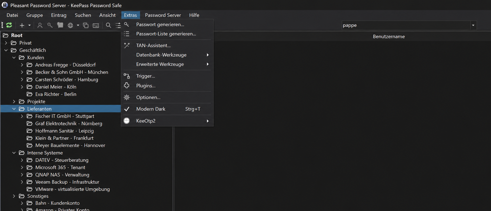

# Pleasant KeePass Dark Mode — Free KeeTheme Dark Theme

**Free KeePass Dark Mode and KeePass Dark Theme for the Pleasant Password Server Windows client (Pleasant Passwords).** Pleasant KeePass Dark Mode is a KeeTheme-based plugin for KeePass for Pleasant Password Server (Pleasant KeePass), adding a dark interface, modern icons and dark menus.

**Kostenloser Dark Mode (dunkles Theme) für Pleasant KeePass / Pleasant Password Server unter Windows** mit dunkler Oberfläche, modernen Icons und dunklen Menüs. Eigenständiger Fork von KeeTheme Modern Dark 1.1.19.
Version: **1.0.0**. Maintainer: Marcin Kulmaczewski (kulmi84).

[**Download Pleasant KeePass Dark Mode 1.0.0**](https://github.com/kulmi84/Pleasant-KeePass-Dark-Mode/releases/tag/v1.0.0) · [Installation](#installation-manuell) · [Windows installer](#automatische-installation-unter-windows)

## Which KeePass dark theme do I need?

- **KeePass for Pleasant Password Server on Windows:** use this repository, **Pleasant KeePass Dark Mode 1.0.0**, based on KeeTheme Modern Dark 1.1.19. The confirmed setup is KeePass 2.54 (64-bit) with Pleasant Password Server Plugin 9.2.0.0; other Pleasant-specific dialogs have not been systematically tested.
- **Regular KeePass 2 on Windows:** use [KeePass Modern Dark Theme](https://github.com/kulmi84/KeePass-Modern-Dark-Theme), the separate KeeTheme fork for standard KeePass.

This free, MIT-licensed plugin themes the Windows client. It is an independent project, not an official Pleasant Solutions product. See the installation and compatibility notes below.

## Compatibility / Kompatibilität

**English:** Looking for a free dark mode for your current Pleasant KeePass / Pleasant Password Server installation? The confirmed configuration is **KeePass 2.54 (64-bit) with Pleasant Password Server Plugin 9.2.0.0**. Compatibility with other or newer client/plugin versions has not been verified. Compare your installed versions before installing; some Pleasant-specific dialogs remain untested. This theme is for the Windows client, not the server web interface.

**Deutsch:** Du suchst einen kostenlosen Dark Mode oder ein dunkles Design für deine aktuelle Pleasant-KeePass-Installation? Bestätigt ist **KeePass 2.54 (64-Bit) mit Pleasant Password Server Plugin 9.2.0.0**. Die Kompatibilität mit anderen oder neueren Client-/Plugin-Versionen ist nicht nachgewiesen. Vergleiche vor der Installation deine Versionsangaben; einzelne Pleasant-spezifische Dialoge sind noch ungeprüft. Das Theme betrifft den Windows-Client, nicht die Weboberfläche des Servers.

Das Plugin ist kostenlos unter der MIT-Lizenz verfügbar. Dieses Projekt ist unabhängig von Pleasant Solutions und kein offizielles Herstellerprodukt.



Unveränderte Aufnahme, vom Nutzer als Projektvorschau bereitgestellt.

## Ziel und Stand

Zielkonfiguration laut Nutzer-Screenshots: KeePass 2.54 (64-Bit), Pleasant Password Server Plugin 9.2.0.0.
Der Build wurde erfolgreich gegen die lokal installierte Pleasant-KeePass.exe geprüft.
Der Nutzer hat am 7. Oktober 2026 bestätigt, dass das Theme im Pleasant-Client läuft. Einzelne Pleasant-spezifische Dialoge sind noch nicht systematisch geprüft.
Die vorhandenen Modern-Dark-Funktionen sind übernommen.

## Änderungen gegenüber Modern Dark 1.1.19

- Build und Visual-Studio-Projekt verwenden standardmäßig die Pleasant-KeePass.exe.
- Ältere PwUuid-API: Vergleich mit PwUuid.Zero statt der nicht vorhandenen IsZero-Eigenschaft. Benutzerdefinierte Icons bleiben dadurch ausgenommen.
- Die neuere lokalisierte Ressource MoreCommands wird nur verwendet, wenn die API sie bereitstellt.
- Eigenständiges Projekt Pleasant KeePass Dark Mode mit Version 1.0.0.

Assemblyname, Plugin-Klasse und Dateiname bleiben KeeTheme, damit KeePass das Plugin laden kann.
Dieser Fork ersetzt im Pleasant-Client die bestehende KeeTheme.dll; beide Varianten dürfen dort nicht gleichzeitig installiert werden.

[**Plugin-ZIP herunterladen / Download dark mode plugin**](https://github.com/kulmi84/Pleasant-KeePass-Dark-Mode/releases/latest)

Das Release-ZIP enthält das installierbare Plugin **KeeTheme.dll**, README und Lizenz. Kein eigener Client erforderlich.

## Automatische Installation unter Windows

ZIP von diesem Release herunterladen und vollstaendig entpacken. **PowerShell als Administrator** oeffnen und im entpackten Ordner ausfuehren:

```powershell
powershell.exe -NoProfile -ExecutionPolicy Bypass -File .\Install-PleasantDarkMode.ps1
```

Der Installer findet den Pleasant-Client in den Standardordnern, prueft die SHA-256-Pruefsumme der DLL und verlangt, dass der Client geschlossen ist. Vorhandene `KeeTheme.dll`/`KeeTheme.plgx` werden ausserhalb des Plugins-Ordners unter `KeeTheme-backups` gesichert. Danach wird die neue DLL installiert und gezielt mit `Unblock-File` freigegeben. Bei einem Installationsfehler werden vorhandene Plugin-Dateien wiederhergestellt.

Abweichender Installationsordner:

```powershell
powershell.exe -NoProfile -ExecutionPolicy Bypass -File .\Install-PleasantDarkMode.ps1 -InstallDirectory 'D:\Pleasant\KeePass'
```

Mit `-WhatIf` laesst sich der geplante Vorgang ohne Installation pruefen. `ExecutionPolicy Bypass` gilt nur fuer diesen PowerShell-Aufruf; die dauerhafte Einstellung wird nicht geaendert. Eine zentral vorgegebene Unternehmensrichtlinie kann die Skriptausfuehrung weiterhin verhindern. Dann die manuelle Installation verwenden.

**English:** Extract the release ZIP, close Pleasant KeePass, and run the command above in an administrator PowerShell window. The installer verifies the DLL hash, backs up existing theme plugins, installs the DLL and unblocks that DLL only.

## Installation (manuell)

1. Pleasant KeePass schließen und die bestehende KeeTheme.dll bzw. KeeTheme.plgx sichern.
2. Die bisherigen KeeTheme-Plugin-Dateien aus dem Pleasant-Plugins-Ordner nehmen.
3. Vor dem Entpacken: Rechtsklick auf das heruntergeladene ZIP → **Eigenschaften → Zulassen → Übernehmen** (falls angezeigt). Dann Release-ZIP entpacken und die enthaltene `KeeTheme.dll` in `C:\Program Files (x86)\Pleasant Solutions\KeePass for Pleasant Password Server\Plugins` kopieren.
4. Pleasant KeePass starten und unter **Extras → Optionen → KeeTheme** das Theme **Modern Dark** aktivieren.
5. Hauptfenster, Password-Server-Menü, Anmeldedialog, Gruppen-/Eintragsdialoge und Theme-Umschaltung prüfen.

Die Konfigurationsschlüssel bleiben KeeTheme.* und übernehmen gegebenenfalls vorhandene Theme-Einstellungen.
WebView2-Inhalte und speziell gezeichnete Pleasant-Komponenten benötigen eine eigene Prüfung.

## Windows blockiert das Plugin (0x80131515)

Falls KeePass das Plugin als inkompatibel meldet und in den Details **0x80131515**, „Vorgang wird nicht unterstützt“ oder eine „Netzwerkadresse“ nennt, kann die Windows-Internetmarkierung das Laden der DLL verhindern. Auf einem weiteren Rechner wurde der Fehler durch Freigeben der DLL behoben.

Pleasant KeePass schließen. Rechtsklick auf die installierte `KeeTheme.dll` → **Eigenschaften → Zulassen → Übernehmen**, dann KeePass neu starten. Alternativ PowerShell als Administrator öffnen:

```powershell
Unblock-File -LiteralPath 'C:\Program Files (x86)\Pleasant Solutions\KeePass for Pleasant Password Server\Plugins\KeeTheme.dll'
```

**English:** Before extracting the downloaded ZIP, open Properties, select **Unblock**, and Apply (if shown). If error **0x80131515** occurs after installation, close KeePass and unblock the installed `KeeTheme.dll`, then restart.

[Microsoft: .NET Framework loading of assemblies from remote sources](https://learn.microsoft.com/en-us/dotnet/framework/configure-apps/file-schema/runtime/loadfromremotesources-element).

## Build

In **Windows PowerShell 5.1** aus diesem Projektordner:

```powershell
powershell.exe -NoProfile -ExecutionPolicy Bypass -File .\build\build-local.ps1 -OutputPath "$PWD\dist\KeeTheme.dll"
```

Ein abweichender Clientpfad kann mit `-KeePassPath` angegeben werden.
Der manuelle Ressourcenbuild benötigt Windows PowerShell 5.1; PowerShell 7 unterstützt hier die binär serialisierten ResX-Ressourcen nicht.
Die übernommenen Prüfskripte und `docs/ModernDark.md` dokumentieren den ursprünglichen KeePass-Fork und sind noch keine Pleasant-Testnachweise.

## Herkunft und Lizenz

Basis: [KeePass Modern Dark Theme](https://github.com/kulmi84/KeePass-Modern-Dark-Theme), KeeTheme Modern Dark 1.1.19.
Ursprüngliches KeeTheme: [xatupal/KeeTheme](https://github.com/xatupal/KeeTheme), Krzysztof Łaputa.
Lizenz: [MIT](LICENSE). Quellenhinweise für KeePass-Grafiken stehen in `docs/ModernDark.md`.
Dies ist ein unabhängiger Theme-Fork, kein offizielles Produkt von Pleasant Solutions.